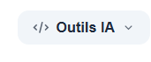
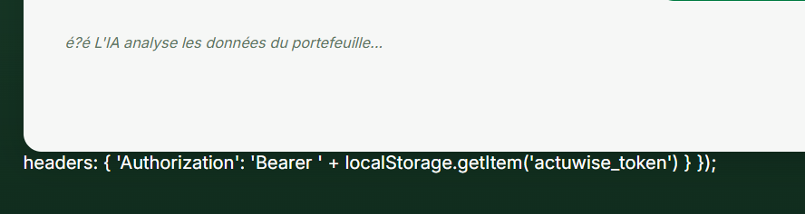
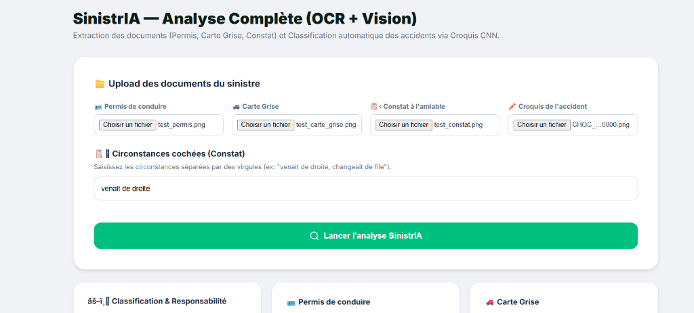
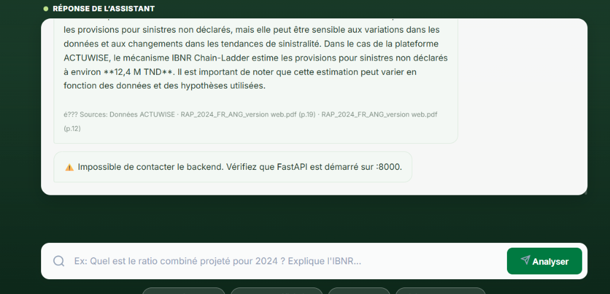

<p align="center">
  
</p>

<h1 align="center">ACTUWISE Studio — Plateforme d'Intelligence Actuarielle 🚀</h1>

<p align="center">
  <strong>Projet de fin d'études / Stage de fin de cycle en Actuariat</strong><br>
  <em>Une plateforme unifiée alliant Modélisation Actuarielle classique (Chain-Ladder, GLM), Machine Learning (XGBoost), Computer Vision (YOLOv8, CNN) et IA Générative (LLM RAG) pour l'assurance Non-Vie.</em>
</p>

---

## 📖 À propos de ce projet et du Stage en Actuariat

Ce projet est l'aboutissement d'un **stage en actuariat** orienté R&D et Data Science appliqué au secteur de l'assurance automobile (portefeuille tunisien). 

La profession actuarielle est en pleine mutation. Les méthodes traditionnelles de tarification et de provisionnement (qui restent la norme réglementaire) doivent aujourd'hui s'interfacer avec les nouvelles capacités de l'Intelligence Artificielle pour gagner en précision, en rapidité et en explicabilité. 

L'objectif de ce stage était de concevoir et développer de zéro **ACTUWISE Studio**, une plateforme métier complète capable de :
1. **Piloter stratégiquement le portefeuille** via un Dashboard Directionnel (KPIs, Ratio Combiné, Évolution de la Sinistralité).
2. **Automatiser les calculs techniques** de la provision pour sinistres à payer (IBNR) et de la prime pure.
3. **Réinventer la gestion des sinistres (Claims Management)** grâce à l'IA (Vision par ordinateur pour chiffrer les dégâts, OCR pour extraire les données des constats).
4. **Intégrer un Assistant IA** capable de fouiller dans la documentation de la compagnie pour assister l'actuaire ou le souscripteur au quotidien.

---

## 📊 Le Dashboard Analytics (Pilotage Stratégique)

Le point d'entrée pour le management et la direction technique est le **Dashboard Actuariel** (`/dashboard.html`). Ce tableau de bord permet de surveiller la santé financière et technique du portefeuille automobile.

<p align="center">
  
</p>

### Indicateurs Clés de Performance (KPIs)
* **Fréquence de sinistralité** : Suivi des déviations par rapport aux prévisions budgétaires.
* **Coût Moyen des Sinistres** : Détection de l'inflation des coûts de réparation et de l'impact des sinistres corporels.
* **Ratio Combiné (S/P + Frais)** : L'indicateur roi en assurance Non-Vie, permettant d'identifier immédiatement si la branche est bénéficiaire ou déficitaire.
* **Analyses Croisées (ApexCharts)** : Répartition du portefeuille par usage (Privé, Professionnel), par zone géographique et par type d'énergie (Essence, Diesel, GPL).

---

## 🛠 L'Application Métier (Modélisation & Opérations)

Accessible via `app.html`, l'application métier est construite sur une architecture Single Page Application ultra-fluide avec une interface "Glassmorphism". Elle s'articule autour de modules spécifiques à chaque tâche de la chaîne de valeur de l'assurance.

### 1. Actuariat Classique & Tarification
* **Analyse de Sinistralité (M1)** : Exploration des cadences de règlement et de la charge de sinistralité par année de survenance.
* **Provisionnement IBNR (M2)** : Implémentation de la méthode **Chain-Ladder** sur les triangles de liquidation pour estimer l'Incurred But Not Reported. Le modèle projette la charge ultime avec un ajustement pour l'inflation.
* **Modélisation des Risques (M3)** : Calcul de la Prime Pure. Un benchmark complet a été réalisé entre un modèle **GLM (Poisson / Gamma)** standard et un algorithme de Gradient Boosting (**XGBoost**), avec intégration de la logique de Bonus-Malus.

<p align="center">
  
</p>

### 2. Gestion de Sinistres Augmentée par l'IA
La déclaration et le chiffrage d'un sinistre coûtent cher en frais de gestion et en temps. ACTUWISE Studio introduit deux révolutions :

* **SinistrIA (Déclaration OCR + CNN)** :
  * Le gestionnaire upload le Constat à l'Amiable, le Permis de conduire et la Carte Grise.
  * **OCR** : Extraction automatique de la plaque, du VIN, du nom et du numéro de permis.
  * **CNN (Réseaux de Neurones Convolutifs)** : Classification automatique du croquis dessiné sur le constat (ex: Choc arrière, Croisement, Stationnement) pour déterminer le niveau de responsabilité via la convention CGA/IDA.

<p align="center">
  
</p>

* **PhotoCar (Computer Vision)** :
  * Évaluation du coût de réparation à partir d'une simple photo du véhicule accidenté.
  * Utilisation du modèle **YOLOv8** pour la détection fine des objets endommagés (Pare-chocs, Aile, Capot, Bris de glace).
  * Le modèle Machine Learning prédit ensuite le coût en TND (Dinars Tunisiens). L'utilisation de **SHAP values** permet à l'actuaire de comprendre exactement quelles parties endommagées font grimper l'estimation.

### 3. Assistant IA (GenAI & RAG)
* Un chatbot spécialisé intégré directement dans l'interface, conçu pour interroger la base de connaissance de la compagnie.
* **Architecture** : RAG (Retrieval-Augmented Generation) combinant la recherche vectorielle / TF-IDF sur des documents PDF (Rapports, Barèmes, Conventions) avec la puissance générative de **Llama 3.3 (via l'API Groq)**.
* **Cas d'usage** : Poser des questions complexes comme *"Comment fonctionne le mécanisme IBNR ?"* ou *"Quelles sont les clauses d'exclusion de la garantie vol ?"*, l'IA répond de manière précise en citant ses sources.

<p align="center">
  
</p>

---

## 🏗️ Architecture Technique et Stack

Le projet sépare rigoureusement la logique mathématique (Python) de l'expérience utilisateur (Web).

* **Frontend** : HTML5, CSS3 Vanilla (design system robuste et responsive), JS.
* **Backend** : `FastAPI` assurant des temps de réponse ultra-rapides et une excellente gestion asynchrone des inférences d'IA.
* **Data & ML** : `pandas`, `scikit-learn`, `xgboost`, `shap`.
* **Vision & NLP** : `ultralytics` (YOLO), `pytesseract`, `easyocr`, LLM via `Groq`.

---

## 🚀 Guide d'Installation

### 1. Démarrer le Backend (API FastAPI)
Assurez-vous d'avoir Python 3.10+ installé.
```bash
cd backend
pip install -r requirements.txt
# Renseignez votre clé API GROQ dans le fichier .env (GROQ_API_KEY=votre_cle)
uvicorn main:app --host 0.0.0.0 --port 8000 --reload
```
L'API sera disponible sur `http://localhost:8000`.

### 2. Démarrer le Frontend (Dashboard & App)
```bash
cd frontend/public
python -m http.server 3000
```
Ouvrez ensuite votre navigateur sur `http://localhost:3000/login.html`.

---

## 🎓 Conclusion 

Ce projet de stage dépasse le simple exercice académique : il constitue un prototype fonctionnel (Proof of Concept) prouvant qu'une compagnie d'assurance peut diviser ses délais de traitement par trois et optimiser son provisionnement en faisant converger les mathématiques actuarielles traditionnelles et l'Intelligence Artificielle de pointe.

---
*Développé avec passion. L'avenir de l'Actuariat s'écrit avec la Data et l'IA.* 📊🤖
